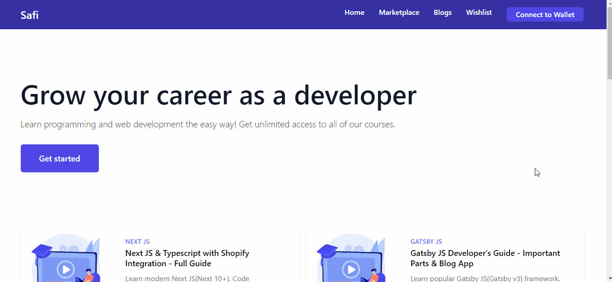
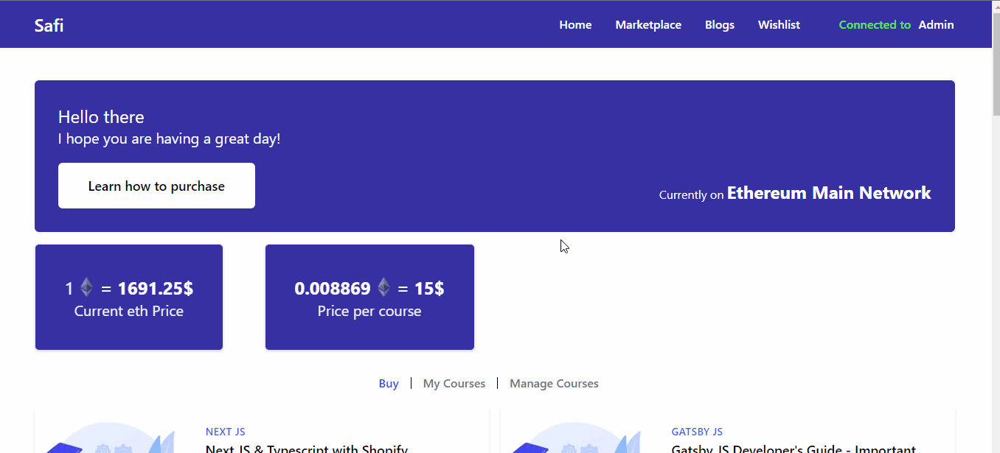

# E-Commerce Store with Blockchain Payment Integration



## :pencil: Introduction

Welcome to the E-Commerce Store project! This e-commerce platform leverages blockchain technology to provide a secure and transparent payment system for purchasing courses. By utilizing a smart contract, this project ensures that customers receive access to the courses they purchase, all while being deployed on a local private chain using Ganache. Additionally, it integrates the Web3 library for seamless interaction with MetaMask and connects to users' wallets. The user interface is designed with the help of Tailwind CSS, providing a clean and responsive layout.

## :zap: Features

- **Blockchain Payments**: The project uses blockchain technology for handling payments, providing a secure and tamper-proof payment system.
  
- **Local Private Chain**: Ganache is used to deploy the project on a local private Ethereum blockchain just for testing purposes, making development and testing straightforward.
  
- **MetaMask Integration**: Users can interact with the platform through MetaMask, allowing them to make payments using their Ethereum wallets.
  
- **Responsive Design**: The user interface is built with Tailwind CSS, ensuring a responsive and visually appealing layout.
  

## Prerequisites

Before getting started with the project, make sure you have the following installed:

- [Ganache](https://www.trufflesuite.com/ganache) - For setting up a local private blockchain.
- [Node.js](https://nodejs.org/) - To run the project and install dependencies.
- [MetaMask](https://metamask.io/) - To interact with the blockchain via the browser.

## Getting Started

Follow these steps to get the project up and running on your local machine:

1. Clone the repository:

   ```bash
   git clone https://github.com/MohamadSafi/ecommerce-store.git
   cd ecommerce-store
   ```
2. Now run `npm install` to install all the dependencies.

* This project is using truffle to compile Solidity smart contracts to the local network.

```bash
npm install -g truffle
```
* Also Dont forget to install Ganache it's needed to creat a private ethereum blockchain network.

_Install [Ganache](https://trufflesuite.com/ganache)_


* Now to compile and deploy the smart contracts:

```bash
truffle migrate
```
* Run the project:
```bash
npm run dev
```
